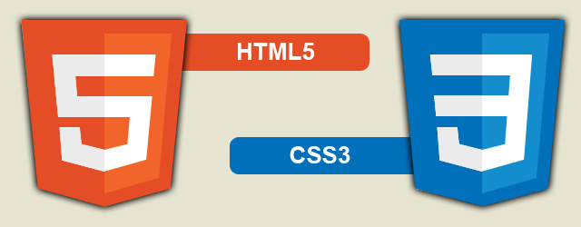
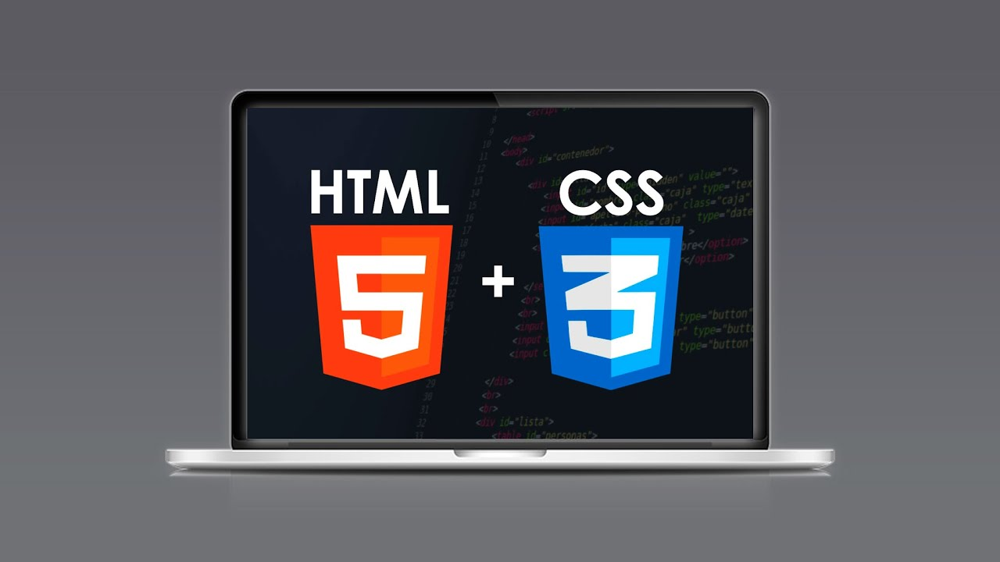

# Curso: Desarrollo Web con HTML | código 62528

> Curso: Desarrollo Web con HTML |  
> Martes y Jueves 10hs a 13hs (Arg) | 
> 6 clases ( hasta  07/02/2023 ) 
> Código: 62528 |  
> sensei: Marcos Pinardi |  

## Definición: 

> Es un lenguaje de programación para crear páginas web.  
> Es un lenguaje de marcado (poque cada instrucción es una marca).  
>A las instrucciones les llamamos elementos o etiquetas.  

## Requisitos de software

  1. Un Browser   
  2. Un editor de Código  

### Editores de código

Visual Studio Code: <https://code.visualstudio.com/>    
Sublime Text: <https://www.sublimetext.com/>   

## Sintáxis

>La sintáxis de HTML corresponde a un sistema de contenedores	

	<elemento>
		objeto
	</elemento>

	<elemento>
		<elemento>
			objeto
		</elemento>
	</elemento>

> Nota: en HTML todos son contenedores, EXCEPTO las interrupciones.  

## Fórmula de HTML

    <elemento atributo="valor">
      	objeto
	</elemento>

## Fórmula de CSS

    selector{
		atributo:valor;
	}

